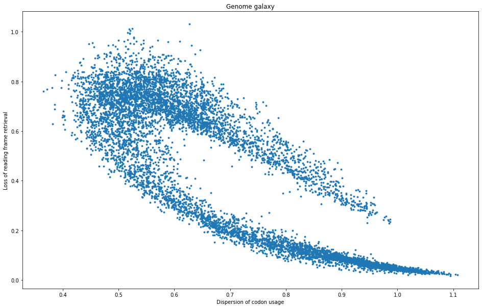

# GalaxyPredictor

This is a simple prediction tool to classify genomes into their respective galaxy postition, according to the famous article :
[Michel, C.J., Sereni, JS. Reading Frame Retrieval of Genes: A New Parameter of Codon Usage Based on the Circular Code Theory. Bull Math Biol 85, 24 (2023).](https://doi.org/10.1007/s11538-023-01129-4)

A pre-trained model for Archaea is provided, classifying genomes into the following types:
- Upper arm
- Center
- Lower arm

## Installation

You'll need scikit-learn.